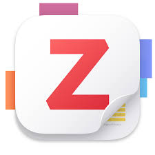

{: width="972" height="589" .w-50 .left}
Zotero, the freeware reference manager, has reached a major milestone with the release of **Zotero 7**, after an extensive period of 365+ days and over 100+ beta versions. This latest version allows seamless integration with various platforms including browsers, remote databases like **Zoofr**, Markdown databases like **Zettlr**, Microsoft and Google products, **Overleaf**, and **Notero**.

### You can integrate zotero zettlr
[Download zetllr](https://www.zettlr.com/)

[Check this Documentation for usage](https://docs.zettlr.com/en/)

Dr. **Chinmaya S Rathore**, former professor at **IIFM**, has shared a tutorial on Zotero 7. 

### Explore the tutorial here:  
[Zotero 7 Tutorial](https://www.youtube.com/playlist?list=PLKR_CvN6SDJgb0ZzYUfKB39lE2AHvVhcJ)

### Enhance your research experience by downloading Zotero 7:  
[Download Zotero 7](https://www.zotero.org/blog/zotero-7/)

### Access all Addons here:  
[Zotero Addons](https://github.com/syt2/zotero-addons/releases/tag/V1.7.2)

### For a Zotero manual, visit:  
[Zotero Manual](https://zotero-chinese.com. )

### Additionally, optimize your workflow with the MSWord Macro code for Citations HyperLink available at:  
[MSWord Macro Code](https://github.com/altairwei/ZoteroLinkCitation)

### If you want to contribute, Zotero is hosted on Github. For plugin development, use this template:  
[Zotero GitHub & Plugin Template](https://github.com/windingwind/zotero-plugin-template)

#Zotero #ReferenceManager #AcademicResearch
